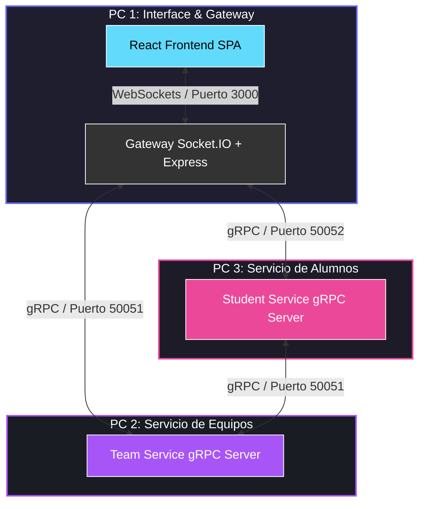

# 🎓 TeamGenerator: Sistema Distribuido de Equipos Escolares 🚀

[](https://grpc.io/)
[](https://socket.io/)
[](https://react.dev/)
[](https://vite.dev/)
[](https://tailwindcss.com/)

Un sistema interactivo en tiempo real diseñado para entornos educativos que distribuye de manera **equitativa** e instantánea a los alumnos en equipos de trabajo mediante una arquitectura distribuida de microservicios con **gRPC**, **WebSockets (Socket.IO)** y un frontend premium en **React**.

---

## 🗺️ Arquitectura del Sistema

El sistema está diseñado para ejecutarse de forma distribuida en múltiples computadoras conectadas a la misma red local:



---

## ✨ Características Principales

*   **⚡ Asignación en Tiempo Real:** Los alumnos ingresan el código de sala y son asignados de inmediato. El tablero del docente se actualiza sin recargar la página.
*   **⚖️ Distribución Equitativa Inteligente:** Algoritmo que calcula el tamaño actual de los equipos y asigna a los nuevos estudiantes únicamente a los equipos con menos integrantes. ¡Diferencia máxima de 1 alumno entre equipos!
*   **🚫 Control de Capacidad (Límites):** Permite configurar un límite máximo de alumnos al crear la sala. Si se alcanza, el sistema rechaza los registros avisando de forma interactiva.
*   **📡 Arquitectura Híbrida gRPC + WebSockets:** La interfaz cliente se comunica con el servidor Gateway mediante WebSockets bidireccionales, y este escala internamente hacia microservicios desacoplados vía gRPC.

---

## 🛠️ Tecnologías Utilizadas

*   **Frontend:** React (Vite), Tailwind CSS v4, Lucide Icons, Canvas Confetti.
*   **Gateway Backend:** Node.js, Express, Socket.IO, `@grpc/grpc-js`.
*   **Microservicios Backend:** Node.js, gRPC, Protobuf (`classroom.proto`).

---

## 📁 Estructura del Proyecto

```text
├── shared-proto/
│   └── classroom.proto        # Definición de interfaces gRPC e intercambio de datos
├── team-service/
│   ├── index.js               # Servidor gRPC para la creación y consulta de salas
│   └── package.json
├── student-service/
│   ├── index.js               # Servidor gRPC de alumnos y algoritmo de distribución
│   └── package.json
├── gateway/
│   ├── index.js               # Servidor Express + WebSockets (Socket.IO) -> Cliente gRPC
│   └── package.json
└── frontend/
    ├── src/
    │   ├── App.jsx            # Interfaz de usuario (Docente / Alumno)
    │   └── index.css          # Estilos CSS y Tailwind CSS v4
    └── package.json
```

---

## 🚀 Guía de Despliegue

### Opción A: Modo Local (En una sola computadora)

1.  **Instalar dependencias** en las 4 carpetas:
    ```bash
    cd team-service && npm install
    cd ../student-service && npm install
    cd ../gateway && npm install
    cd ../frontend && npm install
    ```
2.  **Iniciar los servicios en segundo plano** (abre terminales dedicadas para cada uno):
    *   **Servicio de Equipos:** `cd team-service && npm start`
    *   **Servicio de Alumnos:** `cd student-service && npm start`
    *   **Gateway:** `cd gateway && npm start`
    *   **Frontend:** `cd frontend && npm run dev`
3.  **Probar:** Abre [http://localhost:5173](http://localhost:5173) en tu navegador.

---

### Opción B: Modo Distribuido (Múltiples Computadoras)

*Requisito: Todas las laptops deben estar en la misma red Wi-Fi.*

1.  **Identificar las IPs locales** de cada laptop corriendo `ipconfig` (ej: `192.168.2.X`).
2.  **Copiar los proyectos** correspondientes a cada laptop (asegurándote de incluir la carpeta `shared-proto` en el mismo nivel relativo):
    *   **PC 1 (Gateway + Frontend):** Carpetas `/gateway`, `/frontend`, `/shared-proto`
    *   **PC 2 (Team Service):** Carpetas `/team-service`, `/shared-proto`
    *   **PC 3 (Student Service):** Carpetas `/student-service`, `/shared-proto`
3.  **Crear archivos de entorno `.env`:**
    *   **En la PC 3 (Student Service):** Crea `.env` dentro de `student-service/`:
        ```env
        TEAM_SERVICE_HOST=IP_DE_LA_PC_2
        TEAM_SERVICE_PORT=50051
        ```
    *   **En la PC 1 (Gateway):** Crea `.env` dentro de `gateway/`:
        ```env
        TEAM_SERVICE_HOST=IP_DE_LA_PC_2
        TEAM_SERVICE_PORT=50051
        STUDENT_SERVICE_HOST=IP_DE_LA_PC_3
        STUDENT_SERVICE_PORT=50052
        ```
4.  **Iniciar servicios:** Corre `npm start` (o `npm run dev` en el frontend) en sus respectivas computadoras.
5.  **Unirse:** Abre en cualquier celular o laptop el enlace: `http://IP_DE_LA_PC_1:5173`.

---

## 🎨 Capturas del Diseño Premium

El frontend implementa una estética de **diseño oscuro futurista** con efecto de vidrio esmerilado (Glassmorphism), micro-animaciones en los botones, glows interactivos en tiempo real y efectos de confeti al unirse satisfactoriamente.

---

Desarrollado con ❤️ para distribución local. ¡Que comience el sorteo! 🎲
